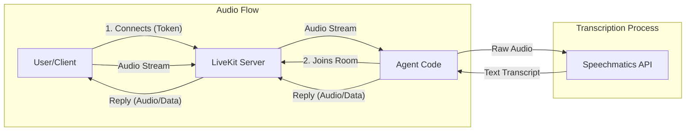

# simple_speechmatics_lk_agent


graph LR
    A[User] -- Speaks --> B(Client Agent)
    B -- Stream Audio --> C{LiveKit Server}
    C -- Forward --> D[Speechmatics API]
    D -- Transcript --> C
    C -- Data --> B


We use **uv** for package management. Please follow the [official installation guide](https://docs.astral.sh/uv/getting-started/installation/) or simply use the command for your system below:

**macOS / Linux:**
```bash
curl -LsSf [https://astral.sh/uv/install.sh](https://astral.sh/uv/install.sh) | sh

**Windows:**
powershell -c "irm [https://astral.sh/uv/install.ps1](https://astral.sh/uv/install.ps1) | iex"


# simple_speechmatics_lk_agent

A simple AI voice agent using **Speechmatics** for transcription and **LiveKit** for real-time audio streaming.

## System Architecture

This diagram illustrates how the client (User) interacts with the Agent logic and the LiveKit server.



## Prerequisites

We use **uv** for fast and reliable package management.

### 1. Install `uv`

Click your operating system below to see the installation command:

<details>
<summary><b>🍎 macOS / 🐧 Linux</b></summary>

```bash
curl -LsSf [https://astral.sh/uv/install.sh](https://astral.sh/uv/install.sh) | sh
```

</details>

<details>
<summary><b>🪟 Windows</b></summary>

```powershell
powershell -c "irm [https://astral.sh/uv/install.ps1](https://astral.sh/uv/install.ps1) | iex"
```

</details>

### 2. Verify Installation

Restart your terminal and run:

```bash
uv --version
```

## Setup & Run

1.  **Initialize the project**

    ```bash
    uv init
    ```

2.  **Install dependencies**

    ```bash
    uv add livekit-agents speechmatics-python
    ```

3.  **Run the Agent**

    ```bash
    uv run agent.py

We will now download the LiveKit cli:

```bash
mac
brew install livekit-cli
linux
curl -sSL https://get.livekit.io/cli | bash

windows
winget install LiveKit.LiveKitCLI